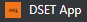

### `npm start`

Runs the app in the development mode.\
Open [http://localhost:3000](http://localhost:3000) to view it in your browser.

The page will reload when you make changes.\
You may also see any lint errors in the console.

### DSET | Simple ReactJs Project

- Welcome to DSET App. This website is designed to provide a simple and efficient solution for automating data annotation. The main goal is to streamline the annotation process for images and videos, making it easier for you to generate annotation XML files. This app made with ReactJS. 

